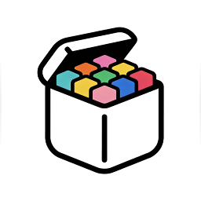
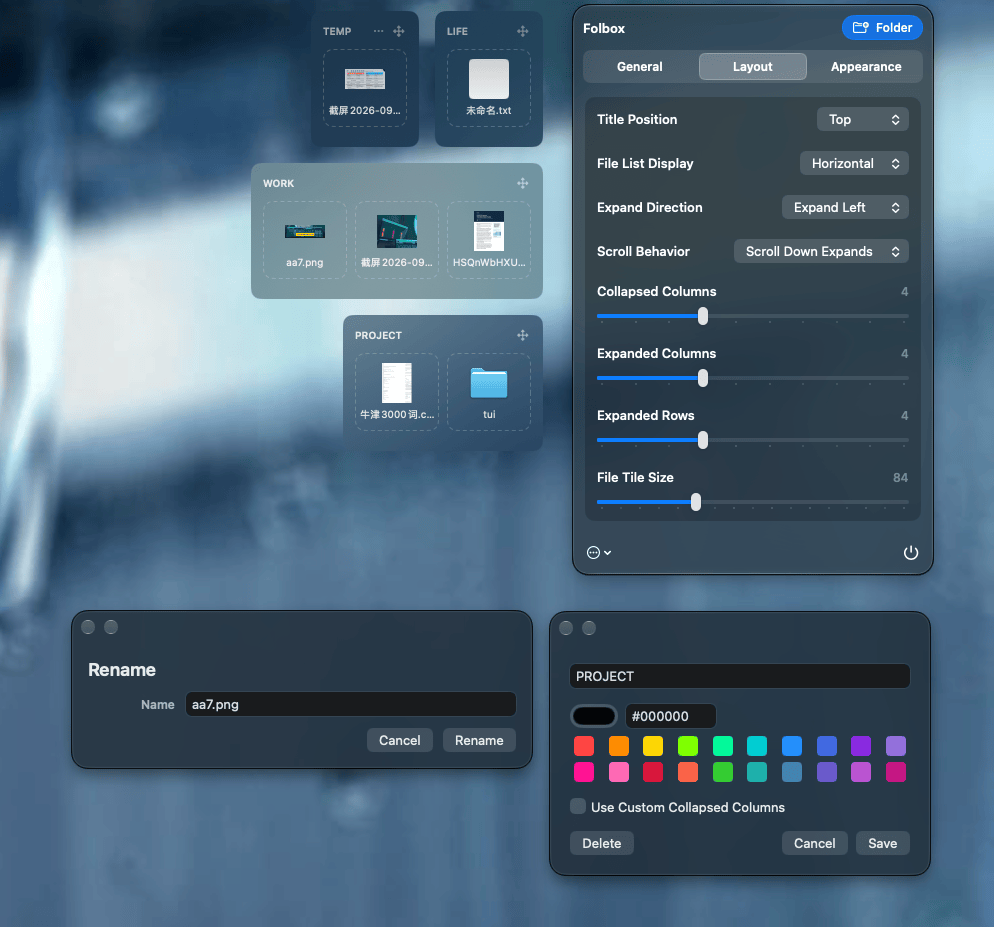

  
  <h3 align="center">Folbox</h3>
  
Desktop components for fast file access on macOS

  

    
    
  

## Overview

Folbox is a menu bar app that lets you build desktop components containing your frequently used files. You can keep these components visible on the desktop area, tune their layout and appearance, and open files quickly with mouse or shortcuts.

## Highlights

- Component-based file collections.
- Desktop panel restore on launch.
- Configurable panel layout and visual style.
- Per-file shortcut registration.
- Launch-at-login support and global panel shortcut settings.
- Built-in update check with Sparkle.

## Screenshot

## Download

[https://github.com/xenroam/Folbox/releases](https://github.com/xenroam/Folbox/releases)

## Requirements

- macOS 14+

## Get Started

1. Download the latest release from GitHub.
2. Move Folbox to your Applications folder.
3. Launch Folbox. The app runs in the menu bar.
4. Open the menu bar panel and click Folder to create your first component.
5. Add files to the component and place it where you want on the desktop area.

## Everyday Usage

- Use components for files you open frequently.
- Tune layout in Settings: General, Layout, and Appearance.
- Use the bottom-left menu for Check for Updates and About.
- Use the power icon to quit the app.

## Privacy and Legal

- Privacy Policy: [docs/PRIVACY.md](./docs/PRIVACY.md)
- Disclaimer: [docs/DISCLAIMER.md](./docs/DISCLAIMER.md)

## Feedback

If you find a bug or want to request a feature, open an issue:

[https://github.com/xenroam/Folbox/issues/new](https://github.com/xenroam/Folbox/issues/new)

## License

This project is licensed under GPL-3.0. See [LICENSE.md](./LICENSE.md).
